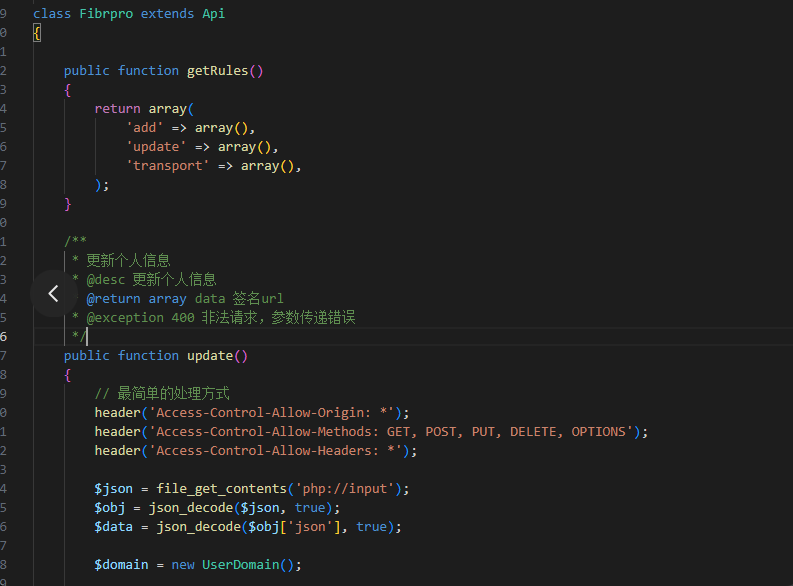

# 另一种方法获取接口参数

先来看常规的获取接口参数的方法：
```php
public function getRules() {
        return array(
            'login' => array(
                'username' => array('name' => 'username', 'require' => true),
                'password' => array('name' => 'password', 'require' => true, 'min' => 6),
            ),
        );
}
```

这种方法，每个接口参数都要单独申明。

当form表单中的元素有增减的时候，后台接口的参数也要随之改动。

当接口参数比较复杂的时候，容易出现疏漏，导致业务出错。


# PHP输入流

`php://input` 是PHP提供的一个特殊流 Wrapper，它允许你访问原始的输入数据(例如 POST 数据)。

使用 `php://input` 有以下几个好处:

1. 可以直接读取POST过来的JSON或XML数据,而不需要解析`$_POST`或`$_GET`数组。
2. 可以读取原始的POST数据,包括文件上传的数据。
3. 可以读取PUT, DELETE或PATCH请求发送过来的数据。
4. 读取的数据量没有限制,不会像`$_POST`和`$_GET`那样受php.ini中max_input_vars和max_input_size的限制。

读取JSON格式的POST数据:
```php
$data = file_get_contents('php://input');
$arr = json_decode($data, true);
print_r($arr);
```

文件上传:
```php
$file = fopen('php://input', 'r');
$contents = '';
while (!feof($file)) {
    $contents .= fread($file, 1024);
}  
```

`$contents`就包含了上传的文件的原始二进制数据,可以保存到文件中或者做其他处理。

读取PUT请求的数据:
```php
$putData = file_get_contents('php://input');
```

# phalapi中使用PHP输入流

> 本文核心内容由Slack中的Ai工具Claude生成，仅供参考

phalapi可以很简单的使用`php://input`来获取输入数据。

你可以在控制器的initialize()方法中读取输入数据:

```php
public function initialize() {
    $this->data = json_decode(file_get_contents('php://input'), true);
}
```

然后在控制器的其他方法中,可以通过`$this->data`访问输入的数据。

这样可以很方便的在phalapi框架下读取JSON格式的POST/PUT/DELETE请求的数据。 

以下是由wenfree提供的例子：



