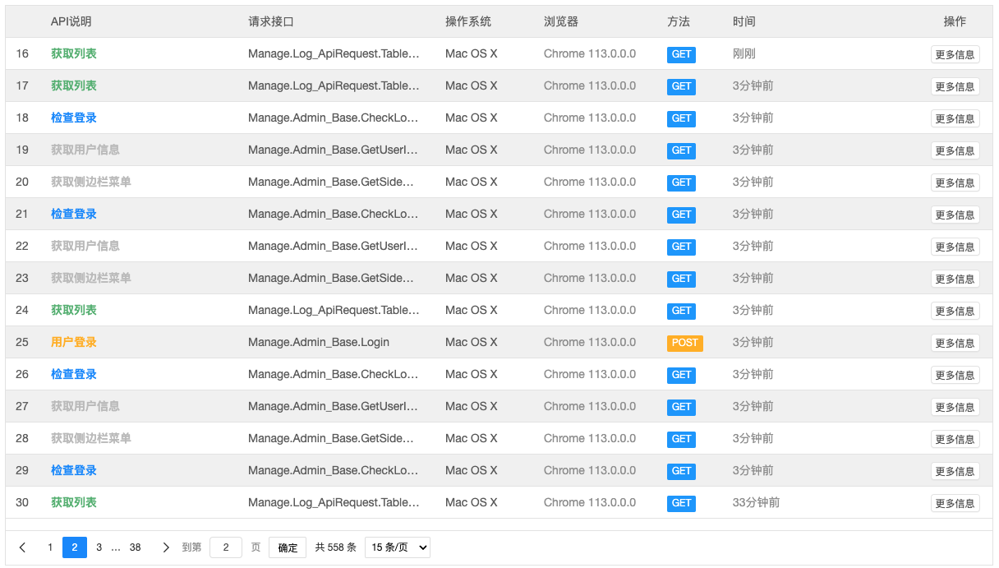

# 前言

在一些后台管理系统中，为了记录客户端的api请求，需要开发api请求日志。

接下来看看如何在phalapi框架中，实现后端记录日志功能。

由于日志的内容比较多，而且请求较为频繁，我们将日志内容，存储在redis中。


## 安装Redis扩展

按照[PhalApi 2.x 扩展类库-Redis扩展](https://github.com/xuepengdong/phalapiredis)中的教程，来逐步安装和配置。

并在“phalapi/config/app.php”中，配置Redis分库`operate_log`

```php
// Redis分库对应关系操作时直接使用名称无需使用数字来切换Redis库
'DB' => array(
   'operate_log' => 4,
)
```

# 编写日志记录功能

在“phalapi/bin”目录下，新建“inner_operate.php”文件

```php
<?php

use Manage\Domain\Log\ApiRequest as ApiRequestDomain;

use function \PhalApi\DI;

/**
 * 记录api请求日志
 * @author feiYun <283054503@qq.com>
 */

$ip = \PhalApi\Tool::getClientIp(); 
$username = \PhalApi\DI()->admin->username;  //获取当前登录的用户名
$action = DI()->request->getServiceAction();
$user_agent = DI()->request->getHeader('User-Agent');

//组装日志数据
$newData = array(
    "id" => \App\createUUID(),   //创建10位随机数字
    "username" => $username,
    'ip' => $ip,
    // 'location' => \App\ipToArea($ip),
    'time' => time(),
    'request_time_float' => $_SERVER['REQUEST_TIME_FLOAT'],
    'params' => DI()->request->getAll(),
    'service' => DI()->request->getService(),
    'name_space' => DI()->request->getNamespace(),
    'class' => DI()->request->getServiceApi(),
    'action' => $action,
    'method' => $_SERVER['REQUEST_METHOD'],
    'protocol' => $_SERVER['SERVER_PROTOCOL'],
    'language' => $_SERVER['HTTP_ACCEPT_LANGUAGE'],
    'request_url' => $_SERVER['REQUEST_URI'],
    'cookie' => $_SERVER['HTTP_COOKIE'],
    'user_agent' => $user_agent,
);
$domain = new ApiRequestDomain();
$domain->createData($newData);  //创建新日志，保存到redis

```

# 编写日志操作类

在“phalapi/src/manage/Domain/Log/ApiRequest.php”中，编写Domain层的日志记录接口

```php
<?php

namespace Manage\Domain\Log;

use PhalApi\Exception\BadRequestException;

class ApiRequest
{
    /**
     * 创建新数据
     * 
     */
    public function createData($newData)
    {
        //key里包含随机id：创建随机数，防止多用户同时操作造成数据污染
        $key = 'Operate_' . time() . '_' . $newData['id'];   //统一设置表中的存储KEY
        $user_operate_log_due_day = 30;   //日志默认保存天数
        \PhalApi\DI()->redis->set_Time($key, json_encode($newData), $user_operate_log_due_day * 24 * 60 * 60, 'operate_log');    //存入一个有时效性的键值队
    }
}
```

这里的ApiRequest类，是编写在Manage命名空间的。

你也可以根据实际的业务需求，将代码放在默认的Api命名空间内。


接下来，在“phalapi/src/manage/Api/Log/ApiRequest.php”中，编写Api层的外部接口

```php
<?php

namespace Manage\Api\Log;

use PhalApi\Api;
use Manage\Domain\Log\ApiRequest as ApiRequestDomain;

use PhalApi\Exception\BadRequestException;

/**
 * 日志-API日志
 */
class ApiRequest extends Api
{
    public function getRules()
    {
        return array(
            'createData' => array(
                'newData' => array('name' => 'newData', 'type' => 'array', 'format' => 'json', 'require' => true, 'desc' => \PhalApi\T('post data')),
            ),
        );
    }

    /**
     * 创建新数据
     * @desc 通用数据接口，创建一条新数据
     * @return int id 新纪录的ID
     * @method POST
     * @ignore
     */
    public function createData()
    {
        $domain = new ApiRequestDomain();
        return $domain->createData($this->newData);
    }
}
```

`createData`这个接口，是不需要外部访问的，因此这里我们隐藏了这个接口。


# 开始记录日志

由于需要记录框架的所有api请求，因此，在框架初始化的时候，就要做请求拦截。

进入“phalapi/public/init.php”，添加如下代码：

```php
// 记录api请求日志 By feiYun
include API_ROOT . '/bin/inner_operate.php';
```

这样就完成了整个功能的开发。

在前端访问任意api接口，redis中就会留下日志记录。


# 前端示例

## 日志列表



## 更多信息展示


