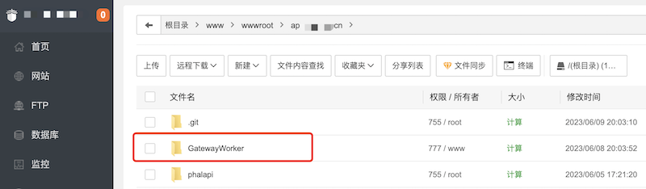
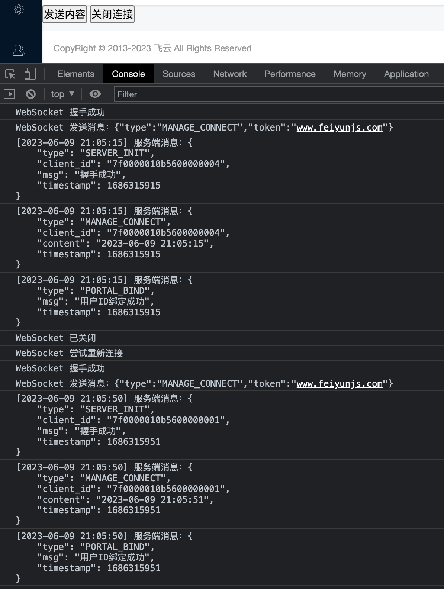

# 如何将phalapi和GatewayWorker结合使用

workman如何调用phalapi接口处理数据？
如何在phalapi接口中调用workman推送数据？

使用phalapi时，开发者最关心的是如何与其他框架或库进行整合，以实现功能互补和增强。
例如，要在phalapi中，实现websocket双向通信，就需要用到第三方库。
根据用户@帅驴老刘 的提示，phalapi和gateway结合使用，大致有以下两种方法：
1、可以把Gateway这个类稍加改造，集成到`$di`
2、也可以把Gateway这个类稍加改造，封装成一个Domain

这篇文章，将使用第2种方法，结合Layui前端框架，和workman文档、GatewayWorker文档、ChatGpt等工具，实现websocket双向通信。

# 开发环境及开发工具
- macOs+VSCode
- 宝塔Linux环境+php7.4
- 腾讯云服务器+域名

# 总体原则:
- 现有mvc框架项目与GatewayWorker独立部署，互不干扰
- 所有的业务逻辑都由网站前端页面post/get到mvc框架中完成
- GatewayWorker不接受客户端发来的数据，即GatewayWorker不处理任何业务逻辑，GatewayWorker仅仅当做一个单向的推送通道
- 仅当mvc框架需要向浏览器主动推送数据时，才在mvc框架中调用Gateway的API GatewayClient完成推送。

# 下载
[GatewayWorker官方下载](https://www.workerman.net/download/GatewayWorker.zip)

将文件解压后，上传到phalapi同级目录



在同一个项目下，这两个文件夹建议分开存放，避免管理混乱。

# 安装Composer

在`GatewayWorker`目录，执行如下命令，安装composer.phar
```asp
curl -sS https://getcomposer.org/installer | php
```

执行install命令

```javascript
php composer.phar install
```

更新目录和依赖

```javascript
php composer.phar update
```

# websocket连接测试

由于源码下载下来后，默认的应用层协议是tcp协议，因此需要修改协议为websocket

打开文件`GatewayWorker/Applications/YourApp/start_gateway.php`
修改`$gateway`进程地址

```php
$gateway = new Gateway("websocket://0.0.0.0:8282");
```

这里使用websocket协议，端口为8282

在宝塔或远程shell工具的命令行里，调用`php start.php start`启动GatewayWorker服务，这个服务是常驻在内存中的

在网上找一款`WebSocket在线测试工具`，输入云服务器的IP和socket端口号，进行连接测试，确保websocket连接成功。
如果连接不成功，请查询workman手册或者通过搜索引擎解决。

```
你 22:20:21
等待服务器Websocket握手包...
你 22:20:21
收到服务器Websocket握手包.
服务器 22:20:21
Websocket连接已建立，正在等待数据...
服务器 22:20:21
Hello 7f0000010b5700000001\r\n
服务器 22:20:21
7f0000010b5700000001 login\r\n
```

# GatewayWorker设置

以下是主要的设置，供你参考
```php
////GatewayWorker/Applications/YourApp/start_gateway.php

// gateway 进程，这里使用Text协议，可以用telnet测试
$gateway = new Gateway("websocket://0.0.0.0:8282");

// gateway名称，status方便查看
$gateway->name = 'YourAppGateway';
// gateway进程数
$gateway->count = 4;
// 本机ip，分布式部署时使用内网ip
$gateway->lanIp = '127.0.0.1';
// 内部通讯起始端口，假如$gateway->count=4，起始端口为4000
// 则一般会使用4000 4001 4002 4003 4个端口作为内部通讯端口 
$gateway->startPort = 2900;
// 服务注册地址
$gateway->registerAddress = '127.0.0.1:1238';

// 心跳设置
// https://www.workerman.net/doc/gateway-worker/heartbeat.html
$gateway->pingInterval = 55;  //客户端连接 ？ 秒内，没有任何数据传输给服务端，则服务端认为对应客户端已经掉线，服务端关闭连接并触发onClose回调。
$gateway->pingNotResponseLimit = 1;  //0,服务端允许客户端不发送心跳;1,客户端必须定时发送数据给服务端，超时会关闭连接。

// $gateway->pingData = '{"type":"SERVER_HEARTBEAT"}';  // 服务端定时向客户端发送心跳数据。
```

# GatewayWorker业务代码

这一块比较重要，是实现websocket业务的核心

```php
/////GatewayWorker/Applications/YourApp/Events.php
/////By feiYun 2023-06-08 17:46:18

use \GatewayWorker\Lib\Gateway;

/**
 * 主逻辑
 * 主要是处理 onConnect onMessage onClose 三个方法
 * onConnect 和 onClose 如果不需要可以不用实现并删除
 */
class Events
{

    /**
     * 当businessWorker进程启动时触发。每个进程生命周期内都只会触发一次
     * 无返回值，任何返回值都会被视为无效的
     * @param int $businessWorker 进程实例
     */
    public static function onWorkerStart($businessWorker)
    {
        echo "WorkerStart\n";
    }

    /**
     * 当客户端连接时触发
     * 如果业务不需此回调可以删除onConnect
     * 当有客户端连接时，将client_id返回，让mvc框架判断当前uid并执行绑定
     * 
     * @param int $client_id 连接id
     */
    public static function onConnect($client_id)
    {
        // debug
        echo "client:{$_SERVER['REMOTE_ADDR']}:{$_SERVER['REMOTE_PORT']} gateway:{$_SERVER['GATEWAY_ADDR']}:{$_SERVER['GATEWAY_PORT']}  client_id:$client_id onConnect:''\n";

        // 向当前client_id发送数据
        Gateway::sendToClient($client_id, json_encode(array(
            'type'      => 'SERVER_INIT',
            'client_id' => $client_id,
            'msg' => '握手成功',
            'timestamp' => time(),
        ), JSON_UNESCAPED_UNICODE | JSON_PRETTY_PRINT));
    }

    /**
     * 当客户端发来消息时触发
     * GatewayWorker建议不做任何业务逻辑，onMessage留空即可
     * 
     * @param int $client_id 连接id
     * @param mixed $message 具体消息
     */
    public static function onMessage($client_id, $message)
    {
        // debug
        echo "client:{$_SERVER['REMOTE_ADDR']}:{$_SERVER['REMOTE_PORT']} gateway:{$_SERVER['GATEWAY_ADDR']}:{$_SERVER['GATEWAY_PORT']}  client_id:$client_id session:" . json_encode($_SESSION) . " onMessage:" . $message . "\n";

        // 客户端传递的是json数据
        $message_data = json_decode($message, true);
        if (!$message_data) {
            return;
        }

        // 根据类型执行不同的业务
        switch ($message_data['type']) {
                // 客户端回应服务端的心跳
            case 'MANAGE_CONNECT':
                // 管理后台：握手成功
                break;
            case 'MANAGE_HEARTBEAT':
                // 管理后台：心跳
                break;
            default:

        }

        // 向当前client_id发送数据
        Gateway::sendToClient($client_id, json_encode(array(
            'type'      => $message_data['type'],
            'client_id' => $client_id,
            'content' => date('Y-m-d H:i:s'),
            'timestamp' => time(),
        ), JSON_UNESCAPED_UNICODE | JSON_PRETTY_PRINT));
    }

    /**
     * 当用户断开连接时触发
     * @param int $client_id 连接id
     */
    public static function onClose($client_id)
    {
        // debug
        echo "client:{$_SERVER['REMOTE_ADDR']}:{$_SERVER['REMOTE_PORT']} gateway:{$_SERVER['GATEWAY_ADDR']}:{$_SERVER['GATEWAY_PORT']}  client_id:$client_id onClose:''\n";
    }
}

```

# 将GatewayClient改造成Domain模块

[下载GatewayClient](https://github.com/walkor/GatewayClient)
将php单文件，移动到`phalapi/src/manage/Common/Gateway.php`
注意，这里我使用的命名空间是`manage`，并非默认的`api`
你在开发中，要将文件放在主业务的命名空间中

对该代码进行适当改造，以适应phalapi框架。
大致改动内容：
- 'use \Exception;'，改为'use PhalApi\Exception\BadRequestException;'，并将所有引用同步修改
- 注册中心的端口号，由1236改为1238，必须和'GatewayWorker/Applications/YourApp/start_gateway.php'里的地址和端口号一致

# 实现客户端ID绑定

接下来实现客户端ID绑定的Api接口。
新建Websocket类，编写代码
```php
//////phalapi/src/manage/Api/System/Websocket.php

namespace Manage\Api\System;

use PhalApi\Api;

use Manage\Common\Gateway;

use PhalApi\Exception\BadRequestException;

/**
 * 系统-Socket服务
 */
class Websocket extends Api
{
    public function getRules()
    {
        return array(
            'bindUid' => array(
                'client_id' => array('name' => 'client_id', 'require' => true, 'desc' => 'websocket客户端ID'),
            ),
        );
    }


    /**
     * 将客户端ID和用户的ID进行绑定
     * @desc ws绑定用户，并发送一条测试消息
     * @method POST
     */
    public function bindUid()
    {
        \PhalApi\DI()->admin->check();   //检测用户是否登录，未登录则抛出异常

        // client_id与uid绑定
        $id = \PhalApi\DI()->admin->id;
        Gateway::bindUid($this->client_id, $id);   //无返回值

        // 测试：发送ws消息（正式环境可去掉）
        Gateway::sendToUid($id, json_encode(array(
            'type'      => 'PORTAL_BIND',
            'msg' => '用户ID绑定成功',
            'timestamp' => time(),
        ), JSON_UNESCAPED_UNICODE | JSON_PRETTY_PRINT));   //无返回值
    }
}
```

# 前端javascript代码

```html
<button id="send">发送内容</button>
<button id="close">关闭连接</button>

<!-- https://github.com/gimite/web-socket-js -->
<script src="web_socket.js"></script>

<!-- js部分 -->
<script>
    var wsUrl = 'ws://127.0.0.1:8282';
    var ws = null; // WebSocket 对象
    var heartbeatTimer = null; // 客户端 心跳定时器
    var isReconnect = true; // 是否自动重连

    // 创建 WebSocket 连接
    function createWebSocket() {
        if ("WebSocket" in window) {
            ws = new WebSocket(wsUrl);

            // WebSocket 打开事件
            ws.onopen = function () {
                console.log("WebSocket 握手成功");

                // 当WebSocket通道连接成功后，自动给服务端发送一条json格式的消息
                sendMessage({
                    "type": "MANAGE_CONNECT",
                    "token": "www.feiyunjs.com"
                });

                startHeartbeat();  // 开始客户端心跳定时器
            };

            // WebSocket 收到消息事件
            ws.onmessage = function (event) {
                console.log('[' + formatTimestamp() + '] ' + '服务端消息：' + event.data);
                var data = JSON.parse(event.data);

                if (isJsonObject(data)) {
                    // json数据转换成js对象
                    var data = eval("(" + event.data + ")");
                    var type = data.type || '';
                    switch (type) {
                        // Events.php中返回的init类型的消息，将client_id发给后台进行uid绑定
                        case 'SERVER_INIT':
                            // 利用jquery发起ajax请求，将client_id发给后端进行uid绑定
                            // 下面这个方法是我使用的前端框架中封装的ajax方法。你可以改为常规的ajax请求
                            admin.req(
                                '/?s=Manage.System_Websocket.BindUid',
                                {
                                    client_id: data.client_id,
                                },function (res) {}, 'post');
                            break;
                        case 'SERVER_HEARTBEAT':
                            // 服务端心跳消息，可忽略
                            console.log('[' + formatTimestamp() + '] ' + '收到服务端心跳');
                            break;
                        default:
                            //// 当mvc框架调用GatewayClient发消息时直接alert出来
                            alert(event.data);
                    }
                } else {
                    // 未识别的消息体
                }
            };

            // 发生错误回调
            ws.onerror = function (event) {
                console.log('[' + formatTimestamp() + '] ' + "通信出现异常");
            }

            // WebSocket 关闭事件
            ws.onclose = function () {
                console.log("WebSocket 已关闭");

                stopHeartbeat();  // 停止心跳定时器
                stopCheckHeartbeat();
            };
        } else {
            console.log("该浏览器不支持 WebSocket");
        }
    }

    // 发送消息
    function sendMessage(message) {
        if (ws != null && ws.readyState == WebSocket.OPEN) {
            // 判断消息是否为json对象
            message = isJsonObject(message) ? JSON.stringify(message) : message;
            ws.send(message);
            console.log("WebSocket 发送消息：" + message);
        } else {
            console.log("WebSocket 连接没有建立或已关闭");
        }
    }

    // 开始心跳定时器
    function startHeartbeat(interval) {
        interval = interval || 50;
        heartbeatTimer = setInterval(function () {
            sendMessage({
                "type": "MANAGE_HEARTBEAT",
            });
        }, interval * 1000);
    }

    // 停止客户端心跳定时器
    function stopHeartbeat() {
        clearInterval(heartbeatTimer);
    }

    // 启动 WebSocket 连接
    createWebSocket();

    // 发送消息
    $('#send').click(function (data) {
        if (ws.readyState != WebSocket.OPEN) {
            console.log('[' + formatTimestamp() + '] ' + 'Error：连接已关闭，操作失败');
            return;
        }

        sendMessage({
            "type": "MANAGE_MESSAGE",
            "content": "Hello feiYun"
        });

        console.log('[' + formatTimestamp() + '] ' + '发送内容');
    });

    // 关闭连接
    $('#close').click(function (data) {
        if (ws.readyState != WebSocket.OPEN) {
            console.log('[' + formatTimestamp() + '] ' + 'Error：连接已关闭，操作失败');
            return;
        }

        ws.close();

        console.log('[' + formatTimestamp() + '] ' + '关闭连接');
    });

    /** 
     * 格式化时间戳，转为时间日期格式yyyy-mm-dd hh:mm:ss
     * @param  {int}    timestamp 要格式化的时间 默认为当前时间 (毫秒级时间戳)
     * @return {string}           格式化的时间字符串 2023-06-09 10:19:59
     */
    function formatTimestamp(timestamp) {
        var jsdate = timestamp || new Date().getTime();
        var now = new Date(jsdate),
            y = now.getFullYear(),
            m = now.getMonth() + 1,
            d = now.getDate(),
            x = y + "-" + (m < 10 ? "0" + m : m) + "-" + (d < 10 ? "0" + d : d) + " " + now.toTimeString().substr(0, 8);
        return x;
    }

    /** 
     * 计算当前时间戳和之前某个时间戳之间的时间差，返回秒数
     * @param timestamp 之前的秒级时间戳
     * @auth Claude插件
     */
    function getTimeDiff(timestamp) {
        // 当前时间
        let now = new Date();
        // 将时间戳转为 Date 对象
        let target = new Date(timestamp);
        // 计算时间差
        let diff = now - target;
        // 转化为秒数
        let seconds = Math.floor(diff / 1000);

        return seconds;
    }

    // 判断是否为json对象
    function isJsonObject(params) {
        if (params && typeof params === "object" && params.constructor === Object && params.toString() === "[object Object]") {
            return true;
        }
        return false;
    }
</script>
```

在上面的代码中，我们通过 createWebSocket() 函数创建一个 WebSocket 连接
当 WebSocket 连接成功后，会触发 onopen 事件，并且开始心跳定时器，定时发送心跳数据。
当 WebSocket 收到消息时，会触发 onmessage 事件，并且打印收到的消息内容。
当 WebSocket 关闭时，会触发 onclose 事件，并且停止心跳定时器。
在发送消息时，我们通过 sendMessage() 函数实现，如果 WebSocket 连接没有建立或已关闭，会打印相应的提示信息。
最后，我们通过 startHeartbeat() 和 stopHeartbeat() 函数实现心跳定时器的启动和停止。

# 前端测试

以下是前端测试的控制台日志。
代码中实现了服务端断线后，客户端自动重连。
这个技术点作为作业，留给你自己去思考和实现。


